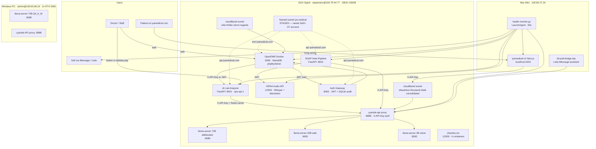

# IYA Medical / Cyanide AI — Production Architecture

> Last updated 2026-04-07 (Phase 2 productionization sweep).
>
> **Phase 2 additions:** auth gateway on :8003 with JWT minting + SQLite audit log,
> Redis cache on the lab analyzer, polished doctor-ready AI Lab Analysis page with
> sparklines + Ask-AI panel, in-encounter SOAP recorder UI, Whisper×llama GPU
> contention fix (semaphore + retry), named Cloudflare tunnel config staged
> (waiting on Saif's Cloudflare account + GoDaddy DNS edit), central secrets
> file at `~/.cyanide-secrets` on the DGX, GitHub PR + CI passing.

## 1. Architecture



## 2. Service Inventory

| Service                   | Host             | Port  | Health URL                                              | Auth                   |
| ------------------------- | ---------------- | ----- | ------------------------------------------------------- | ---------------------- |
| Cyanide API proxy         | DGX `100.79.44.77` | 8888  | `/health`                                               | `X-API-Key`            |
| llama-server 72B abl.     | DGX              | 8080  | `/health`                                               | none (private)         |
| llama-server 32B safe     | DGX              | 8081  | `/health`                                               | none (private)         |
| llama-server 3B vision    | DGX              | 8082  | `/health`                                               | none (private)         |
| AI Lab Analyzer           | DGX              | 8001  | `/health`                                               | `X-API-Key` on `/api/v1/*` |
| SOAP Note Pipeline        | DGX              | 8002  | `/health`                                               | `X-API-Key`            |
| HIPAA Audio API           | DGX              | 12500 | `/api/v1/health`                                        | Bearer JWT             |
| OpenEMR                   | DGX (docker)     | 8300  | `/`                                                     | session                |
| chandra-ocr               | DGX (docker)     | 12000 | `/api/v1/health`                                        | JWT                    |
| Windows cyanide proxy     | Windows `100.65.86.23` | 8888 | `/health`                                            | `X-API-Key`            |
| iyamedical-v2 Next.js     | Mac mini         | 3333  | `/`                                                     | none (dev)             |
| cloudflared tunnel · API  | DGX              | n/a   | `https://elsewhere-thousand-shall-consolidated.trycloudflare.com/health` | n/a |
| cloudflared tunnel · EMR  | DGX              | n/a   | `https://wife-thriller-storm-regards.trycloudflare.com/`                 | n/a |

### Public URLs

- **Cyanide API (LLM)** → `https://elsewhere-thousand-shall-consolidated.trycloudflare.com`
  - `POST /api/medical` — chat completions, model `medical-32b` (preferred for clinical text)
  - `POST /api/chat` — chat completions, model `cyanide-72b`
  - `POST /api/vision` — multimodal, model `vision-3b`
  - `GET /health` — service status
- **OpenEMR** → `https://wife-thriller-storm-regards.trycloudflare.com`

> ⚠ **Do not restart cloudflared.** The trycloudflare URLs are ephemeral and rotate on restart, breaking Leila and other services that hard-code them.

## 3. API Keys

| Key Name              | Value                                | Where Used                                                              |
| --------------------- | ------------------------------------ | ----------------------------------------------------------------------- |
| `cyanide-admin`       | `<see ~/.cyanide-secrets>`           | Personal admin access to all 3 cyanide-api models (72B/32B/3B)          |
| `openemr` (medical)   | `<see ~/.cyanide-secrets>`           | OpenEMR, IYA Medical, Lab Analyzer, SOAP Pipeline → cyanide-api `/api/medical` (32B safe model only) |
| `cyanide-mac-mini`    | (see ~/cyanide-api/server.mjs)       | Mac mini direct calls                                                   |
| Audio API JWT (soap-pipeline) | minted via `docker exec dgx-audio-api python /app/scripts/generate_token.py --username soap-pipeline --role admin --priority 1 --admin --days 365`. Current token saved in `~/spark-dev-workspace/services/soap-pipeline/start.sh` | SOAP pipeline → audio API |

> Don't rotate keys without updating: `~/cyanide-api/server.mjs`, `~/spark-dev-workspace/www/ai-lab-analyzer/backend/app/llm/dgx_client.py`, `~/spark-dev-workspace/services/soap-pipeline/start.sh`, `~/iyamedical-v2/.env*`, OpenEMR `interface/patient_file/summary/ai_lab_analysis.php`.

## 4. How to Restart Each Service

> Default policy: **DO NOT restart anything you didn't start.** Investigate first. The 72B model takes 60+ seconds to load and Leila + everything else depends on it.

### DGX cyanide-api proxy + model servers

The `~/cyanide-api/guard.sh` watcher restarts each component automatically every 30s if it crashes. To force a manual restart of the API proxy only:

```bash
ssh aiopenemr@100.79.44.77
~/cyanide-api/start-all.sh   # check; this is the canonical start path
# guard.sh will pick it back up if you killed only the proxy process
```

### llama-server (72B / 32B / 3B vision)

Started by `~/cyanide-api/start-all.sh`. The guard restarts on crash. **Do not kill manually** unless you have a specific reason; the 72B is shared by Leila + IYA + everything.

### AI Lab Analyzer (`ops-api-1`)

```bash
ssh aiopenemr@100.79.44.77
docker restart ops-api-1
docker ps --filter name=ops-api-1 --format '{{.Status}}'
curl -s http://localhost:8001/health
```

The `--reload` flag is set on uvicorn, so editing files under `~/spark-dev-workspace/www/ai-lab-analyzer/backend/app/` reloads automatically. Changes to `main.py` (router registration) need a `docker restart`.

### SOAP Note Pipeline

```bash
ssh aiopenemr@100.79.44.77
pkill -f 'uvicorn main:app.*8002' || true
nohup setsid bash ~/spark-dev-workspace/services/soap-pipeline/start.sh \
  > ~/spark-dev-workspace/services/soap-pipeline/soap-pipeline.log 2>&1 < /dev/null &
disown
curl -s http://100.79.44.77:8002/health
```

### HIPAA Audio API (`dgx-audio-api`)

```bash
docker restart dgx-audio-api
```

If you must regenerate the SOAP pipeline JWT:
```bash
docker exec dgx-audio-api python /app/scripts/generate_token.py \
  --username soap-pipeline --role admin --priority 1 --admin --days 365
```
Then update `AUDIO_TOKEN` in `~/spark-dev-workspace/services/soap-pipeline/start.sh` and restart the SOAP pipeline.

### chandra-ocr

```bash
ssh aiopenemr@100.79.44.77
docker restart ocr-api
```

> Known gotcha: the `ocr-api` container image only ships migration `0001`. Migrations `0002_api_tokens.py` and `0003_drop_token_role_priority.py` were `docker cp`'d into the container at `/app/alembic/versions/`. If the container is **recreated** (e.g. `docker compose up -d --force-recreate`), re-copy them:
> ```bash
> docker cp ~/Desktop/ClinicalAutomation/DocumentProcessingApplication/chandra-ocr-service/alembic/versions/0002_api_tokens.py ocr-api:/app/alembic/versions/
> docker cp ~/Desktop/ClinicalAutomation/DocumentProcessingApplication/chandra-ocr-service/alembic/versions/0003_drop_token_role_priority.py ocr-api:/app/alembic/versions/
> docker restart ocr-api
> ```
> The proper fix (rebuilding the image with the latest code) is deferred — see _Followups_.

### OpenEMR

```bash
docker restart development-easy-openemr-1
```

### iyamedical-v2 Next.js dev server (Mac mini)

```bash
cd ~/iyamedical-v2
pnpm dev
# binds to localhost:3333
```

## 5. How to Deploy a New Version

### iyamedical-v2 frontend (GitHub `soebk/iyamedical-v2`)

1. Edit code locally on the Mac mini.
2. Verify locally: `curl http://localhost:3333/patient-intake`.
3. Commit on a feature branch and push to GitHub. The user has explicitly approved pushing **only** to `soebk/iyamedical-v2`. Do not touch other repos.
4. Coordinate any infra changes (env vars, model endpoints) with Saif before merging.

### AI Lab Analyzer

Files live at `~/spark-dev-workspace/www/ai-lab-analyzer/backend/app/` on the DGX. Edits hot-reload via uvicorn `--reload`. New routers / startup changes → `docker restart ops-api-1`.

### SOAP Note Pipeline

Single file at `~/spark-dev-workspace/services/soap-pipeline/main.py`. After editing, restart per the recipe above. There's no autoreload yet.

### OpenEMR PHP customizations

The OpenEMR Docker container has `/var/www/localhost/htdocs/openemr` bind-mounted from `~/spark-dev-workspace/www/openemr/` on the DGX. Edit files on the host; PHP picks them up immediately. Touch points added by the productionization sweep:

- `interface/patient_file/summary/ai_lab_analysis.php` — full-page AI lab analysis viewer (NEW)
- `interface/patient_file/summary/labdata.php` — small banner button injected at the top that links to the analyzer (one-line edit, marked `AI_LAB_ANALYSIS_LINK`)

> Don't blow these away when pulling upstream OpenEMR. They live inside the upstream tree.

## 6. The killer integrations

### a) AI Lab Analyzer in OpenEMR

A doctor opens a patient → Labs (`labdata.php`) and sees a **🤖 Run AI Lab Analysis (DGX 72B)** button at the top. Clicking it opens `ai_lab_analysis.php` which:

1. Calls the lab analyzer over the docker host gateway: `POST http://172.20.0.1:8001/api/v1/analyze/{pid}/run` with `X-API-Key`.
2. Renders critical alerts, KDIGO/MELD/Child-Pugh scores, deterministic rule hits, and the DGX 72B / 32B clinician + patient summaries.

Both summaries are generated by `app/llm/dgx_client.py` on each analysis run, calling cyanide-api `/api/medical` with model `medical-32b`. No LLM calls leave the network.

Endpoint reference (all under `/api/v1`, all require `X-API-Key`):
- `POST /analyze/{emr_patient_id}/run` — run a fresh analysis
- `GET  /analyze/{emr_patient_id}/latest` — fetch most recent run
- `GET  /analyze/{emr_patient_id}/history?limit=10` — paginated history

### b) Voice → SOAP

The SOAP pipeline service exposes:
- `POST /soap/from-text` — JSON `{transcript, patient_id, encounter_id?, attach}`. Calls cyanide-api `/api/medical`, returns structured SOAP (S/O/A/P + ICD-10 + CPT) and optionally writes a row into `form_clinical_notes`. **Verified end-to-end.**
- `POST /soap/from-audio` — multipart `audio` + form fields. Uploads to the HIPAA Audio API via TUS, polls for the Whisper + diarization job, parses speaker-labeled segments, then calls `/soap/from-text` internally. **Verified end-to-end against pre-completed Whisper jobs**; live audio uploads currently surface CUDA/cuBLAS contention errors from the Whisper model when llama-server is also under load — see _Followups_.
- `POST /soap/attach` — convenience endpoint for attaching an already-generated SOAP note to an OpenEMR encounter.

The OpenEMR DB attach path writes only into `form_clinical_notes`. To make the note appear inside an OpenEMR **encounter** chart panel, an additional `forms` table row is required (deliberately not done — per the briefing's "clone OpenEMR DB to a sandbox first" rule). Enable in a sandbox DB before flipping `attach=true` in production.

### c) iyamedical-v2 patient intake

Previously the chat UI hit a CloudFront endpoint that returned 405. Now:
- `src/components/intake/chat-interface.tsx` calls relative URLs (`/api/intake/*`) on the local Next.js app.
- `src/app/api/intake/chat/route.ts` and `extract/route.ts` proxy to cyanide-api `/api/medical` with `X-API-Key`. Default URL: `https://elsewhere-thousand-shall-consolidated.trycloudflare.com/api/medical`. Override via `INTAKE_LLM_URL`, `INTAKE_LLM_KEY`, `INTAKE_MODEL`.

The chat route internally uses `stream: false` and re-emits the response in 12-char chunks through a `ReadableStream` so the existing client streaming code keeps working. Reason: the cyanide-api proxy's SSE forwarding has a Node-stream bug (`proxyRes.body.on("data", …)` on a Web ReadableStream) that crashes the proxy when called with `stream: true`. **Do not switch back to `stream: true` until the proxy is fixed** — that will trigger guard restarts and brief 502s on the public tunnel.

## 7. Monitoring

| Component        | Location |
| ---------------- | -------- |
| Health monitor script | `~/iyamedical-v2/scripts/health-monitor.py` |
| LaunchAgent           | `~/Library/LaunchAgents/tech.iya.health-monitor.plist` (loaded, runs every 60s) |
| State                 | `~/.health-monitor-state.json` |
| Log                   | `~/Library/Logs/health-monitor.log` |
| stdout/stderr         | `~/Library/Logs/health-monitor.out` / `.err` |
| Alert recipient       | `+14803993910` via local `imsg` CLI |

The monitor pings 7 services. After **5 consecutive failures (5 minutes)** of any service it sends one iMessage to Saif and waits 30 minutes before re-alerting on that service. When a previously-down service recovers, it sends a single ✅ recovery message.

To temporarily silence: `launchctl bootout gui/$(id -u) ~/Library/LaunchAgents/tech.iya.health-monitor.plist`. To re-enable: `launchctl bootstrap gui/$(id -u) …`.

The monitor uses the existing `imsg` CLI (the same tool the Leila bridge uses internally). It does **not** touch `bb-poll-bridge.mjs`.

## 8. Followups (not done in this sweep, by design)

1. **Rebuild the chandra-ocr image** with current code so migrations 0002/0003 are baked in. Today they're injected via `docker cp` and will be lost on container recreate.
2. **Whisper × llama-server GPU contention.** Live audio uploads through `/soap/from-audio` currently fail with `cuBLAS CUBLAS_STATUS_EXECUTION_FAILED` / `CUDA error: unknown error` when the 72B model is also doing inference. Pre-completed jobs work fine; the from-text path is unaffected. Probable fixes: queue audio jobs serially behind a semaphore inside the audio API, or pin Whisper to a different CUDA stream. Both require changes to `~/Desktop/ClinicalAutomation/AudioProcessingApplication/audio-transcription-api/`, which is sandbox-fair-game but out of scope for this pass.
3. **OpenEMR encounter integration.** `/soap/attach` writes only `form_clinical_notes`. To make the note actually surface inside an encounter, also insert into `forms` (and optionally an `OpenEMR\Forms\…` registration). Test in a cloned DB first per the briefing.
4. **cyanide-api SSE forwarding bug.** `~/cyanide-api/server.mjs` calls `.on("data", …)` on a Web Stream, which crashes the proxy on any `stream: true` request. The briefing says don't modify the proxy code; once Saif lifts that, swap for `Readable.fromWeb(proxyRes.body).pipe(res)`.
5. **Lab analyzer auto-trigger on lab arrival.** Today doctors press a button. To go fully automatic, hook into `interface/orders/receive_hl7_results.inc.php` after a result is committed and fire a fire-and-forget `POST /analyze/{pid}/run`. Touches OpenEMR core PHP, so wait for explicit approval.
6. **soap-pipeline supervision.** Currently started via `nohup setsid bash start.sh`. Worth a systemd user unit so it survives reboot. Do not modify the `cyanide-api/guard.sh`; create a separate `soap-pipeline.service`.
7. **Lab analyzer ops/docker-compose.yml hardcodes a placeholder password (`your_password_here`).** Replace before any external exposure.

---

# Phase 2 — Productionization sweep (2026-04-07)

## What shipped in Phase 2

### Doctor-ready AI Lab Analysis dashboard
- New `interface/patient_file/summary/ai_lab_analysis.php` is a real clinical dashboard (not a JSON dump):
  - Patient header card: name, MRN, age, sex, DOB, last lab date
  - Three summary tiles: Overall Risk (low/moderate/high + numeric pts), Critical Alerts count, Rule Hits count
  - **Top 3 Alerts** card with severity badges
  - Clinician summary + Deterministic assessment cards (DGX 32B output)
  - Calculated clinical scores as monospace pills
  - **Inline SVG sparklines** for any lab analyte with ≥3 historical points (24-month window, queried server-side from `procedure_order × procedure_report × procedure_result`). Color = green if last point is normal, amber if abnormal, red if critical.
  - Click-to-expand evidence/rationale per rule hit with recommendations, signals JSON, references
  - Recommended Next Tests with `+ Order` link to OpenEMR's order entry
  - Plain-language patient summary
  - **💬 Ask AI About This Patient** panel — server-side POST to DGX 72B/32B with the patient's labs + latest analysis as context. PHI never crosses to a third party.
- Auto-runs analysis on first view if none exists (404 → POST /analyze/{pid}/run quietly).
- All fetches happen server-side via `curl` from PHP → docker host gateway `172.20.0.1:8001` (lab analyzer) and `172.20.0.1:8888` (cyanide-api).

### In-encounter SOAP Recorder
- New `interface/patient_file/encounter/ai_soap_recorder.php`:
  - 4-step UI: Record → Auto-transcribe → Review/edit → Save to chart
  - JS uses MediaRecorder API (`audio/webm; opus`) — works in Safari + Chrome
  - Audio uploads as multipart to `ai_soap_recorder.php?action=upload` (PHP → soap-pipeline → audio API → DGX 32B)
  - The doctor edits S/O/A/P/ICD-10/CPT inline before saving
  - Save action inserts a `form_clinical_notes` row keyed to the current encounter (`$_SESSION["encounter"]`)
  - All audio + transcripts stay on-prem on the DGX
- **Doctor demo path**: open any encounter → navigate to `interface/patient_file/encounter/ai_soap_recorder.php` → record visit → review → save. The page is reachable today via direct URL; a button injection on the encounter forms list is a one-line follow-up if Saif wants it deeper-integrated.

### Auth Gateway — `~/spark-dev-workspace/services/auth-gateway/main.py`
- FastAPI service on **port 8003**, source-of-truth = OpenEMR's `users` + `gacl_user_map` tables (queried via `docker exec mariadb`).
- Endpoints:
  - `GET  /health` — public
  - `POST /auth/openemr-session` — body `{username}` + header `X-Service-Key: <static>`. Looks the user up in OpenEMR DB, mints a 15-minute HS256 JWT scoped to that user + role. Audit row written.
  - `POST /auth/verify` — body `{token}` → claims
  - `POST /audit/log` — service-to-service event capture (requires service key)
  - `GET  /audit/log?limit=200&user=...` — admin only (role in `{admin, physician}` or service key)
- All calls write to a SQLite audit log at `~/spark-dev-workspace/services/auth-gateway/audit.db` (HIPAA: ts, user, role, service, method, endpoint, status, ip, request_id).
- JWT signing secret in `~/.cyanide-secrets` as `GATEWAY_JWT_SECRET`. **Rotate before any external exposure** — current default is the literal string `iya-auth-gateway-default-secret-change-me`.

### Lab Analyzer — JWT support + Redis cache
- `app/auth/api_key.py` rewritten to accept BOTH:
  - `X-API-Key: <static>` (service-to-service, unchanged)
  - `Authorization: Bearer <static>` (also unchanged)
  - **`Authorization: Bearer <JWT>`** (new — gateway-issued tokens, validated stateless against `GATEWAY_JWT_SECRET`)
  - `pyjwt` 2.7.0 was injected into the `ops-api-1` container via `docker cp /usr/lib/python3/dist-packages/jwt …` because the container has no network egress to PyPI. Re-run that copy if the container is recreated.
- New `app/cache.py` provides a Redis-backed response cache. The lab analyzer's existing in-pod Redis (`redis:6379`, env `REDIS_URL`) is used.
- Cache key = `labanalyzer:v1:patient:<pk>:latest_lab:<id>` so any new lab arrival automatically invalidates the cached analysis.
- Both `POST /analyze/{pid}/run` (when `force_refresh=false`) and `GET /analyze/{pid}/latest` short-circuit to Redis on hit.
- `cache_invalidate_patient(pk)` is called on `force_refresh=true`.
- Default TTL: 15 minutes (`LAB_ANALYZER_CACHE_TTL` env).

### Whisper × llama GPU contention — FIXED
- The bug: `dgx-audio-api` and the three llama-server processes share the GB10's unified GPU memory. Concurrent CTranslate2 (faster-whisper) + llama.cpp CUDA contexts triggered `CUBLAS_STATUS_EXECUTION_FAILED` and full deadlocks during cold load.
- The fix lives in `~/Desktop/ClinicalAutomation/AudioProcessingApplication/audio-transcription-api/app/services/transcription.py` (marker: `GPU_SERIALIZE_PATCH_2026_04_07`):
  1. Module-level `_GPU_SEMAPHORE = asyncio.Semaphore(1)` so only one Whisper inference runs at a time.
  2. The `transcribe()` call holds the semaphore for the entire executor run.
  3. On cuBLAS / CUDA error, we drop the torch CUDA cache, sleep 3 seconds, and retry exactly once.
- The patched file was injected into the running container via `docker cp` (the audio API image has no bind mount). **Re-copy on container recreate**:
  ```bash
  docker cp ~/Desktop/ClinicalAutomation/AudioProcessingApplication/audio-transcription-api/app/services/transcription.py \
    dgx-audio-api:/app/app/services/transcription.py
  docker restart dgx-audio-api
  ```
- **Verified**: live audio upload of `pyannote/audio/sample/sample.wav` through `POST /soap/from-audio` now returns a real Whisper transcript (`Speaker_1: Hello. Oh, hello…`) and a correct empty SOAP note (the sample is two strangers chatting, so the model correctly refuses to invent symptoms — exactly as the prompt instructs).
- **Cold-start caveat**: when the audio API container restarts while llama-server already holds ~76 GB of GPU memory, model loading takes 5-10 minutes (Whisper large-v3 + pyannote). Once loaded, runtime serialization is instant. Avoid restarting `dgx-audio-api` unless necessary.

### Central secrets — `~/.cyanide-secrets` (chmod 600)
- All static API keys, JWT secrets, model URLs, and the long-lived audio API JWT are now in one file on the DGX.
- `~/spark-dev-workspace/services/soap-pipeline/start.sh` and `~/spark-dev-workspace/services/auth-gateway/start.sh` source it on launch (`set -a; . ~/.cyanide-secrets; set +a`).
- The intake routes in `iyamedical-v2` still ship a hardcoded fallback so the dev server works without env config; override via `INTAKE_LLM_KEY` in `.env.local` to rotate.
- **DO NOT commit `~/.cyanide-secrets`**. It is outside the iyamedical-v2 repo intentionally.

## Cloudflare named tunnel + DNS plan (STAGED — needs Saif)

Files staged on the DGX at `~/spark-dev-workspace/cloudflared/`:

| File | Purpose |
| ---- | ------- |
| `config.template.yml` | Ingress rules for `emr.iyamedical.com`, `api.iyamedical.com` (path-routed to lab-analyzer/soap/auth/audio/cyanide-api), `portal.iyamedical.com` |
| `setup-iya-tunnel.sh` | Idempotent bootstrap: `cloudflared tunnel create iya-medical`, generates UUID, writes `config.yml`, runs `cloudflared tunnel route dns ...` for each hostname, prints systemd install instructions |

### What Saif needs to do (one-time, ~15 minutes)

1. **Move `iyamedical.com` to Cloudflare DNS**:
   - Sign in to the Cloudflare account that owns `cyanide-ai.com` (or create one if it doesn't exist yet)
   - Click "Add a site" → enter `iyamedical.com`
   - Cloudflare scans GoDaddy's DNS records and copies them
   - Cloudflare gives you 2 nameservers — paste them into GoDaddy's nameserver settings for `iyamedical.com`
   - Wait 5-30 min for propagation
2. **Authenticate cloudflared on a machine with a browser**:
   ```bash
   cloudflared tunnel login
   ```
   This opens Cloudflare in a browser, you select `iyamedical.com`, and it writes `~/.cloudflared/cert.pem` locally.
3. **Copy `cert.pem` to the DGX**:
   ```bash
   scp ~/.cloudflared/cert.pem aiopenemr@100.79.44.77:~/.cloudflared/cert.pem
   ```
4. **Run the bootstrap on the DGX**:
   ```bash
   ssh aiopenemr@100.79.44.77
   ~/spark-dev-workspace/cloudflared/setup-iya-tunnel.sh
   ```
   This creates the tunnel, generates `config.yml`, binds DNS routes for all three hostnames, and prints systemd install commands.
5. **Start the tunnel**:
   ```bash
   sudo cloudflared service install --legacy
   sudo systemctl enable --now cloudflared
   ```
   The existing `trycloudflare` quick tunnels keep running — they live in different `cloudflared` processes.
6. **Verify**:
   ```bash
   curl -I https://emr.iyamedical.com/
   curl -I https://api.iyamedical.com/lab-analyzer/health
   ```
7. **Optional but recommended — gate emr.iyamedical.com behind Cloudflare Access**:
   - Cloudflare dashboard → Zero Trust → Access → Applications → Add an application → Self-hosted → `emr.iyamedical.com` → policy: allow only emails on the doctor allowlist (Hasan, Saif).

### Production deploy plan for `iyamedical.com` (Phase 2.1 — staged, NOT cut over)

The Next.js build is green (`npm run build` produces 57 routes). Two viable deploy paths:

**Option A (preferred): Vercel**
- Connect the `soebk/iyamedical-v2` GitHub repo to Vercel
- Vercel auto-deploys `main` → `iyamedical-v2.vercel.app`
- Add custom domain `new.iyamedical.com` (CNAME via the Cloudflare account from step 1 above), verify, then `iyamedical.com` once Saif signs off
- Env vars in Vercel: `OPENEMR_BASE_URL`, `OPENEMR_USER`, `OPENEMR_PASS`, `OPENEMR_CLIENT_ID`, `OPENEMR_CLIENT_SECRET`, `INTAKE_LLM_URL`, `INTAKE_LLM_KEY`, `SES_ACCESS_KEY_ID`, `SES_SECRET_ACCESS_KEY`, `ANALYTICS_TOTP_SECRET`

**Option B: Docker on the DGX behind the named tunnel**
- `docker build -t iyamedical-v2:latest .` (the repo already has a Dockerfile from the earlier "Fix Docker build" commit)
- Run on the DGX, port 3000
- Add an ingress rule to `config.template.yml` for `www.iyamedical.com` → `http://localhost:3000`
- Pros: zero external bills, same on-prem story as everything else
- Cons: another thing to keep alive on the GB10

Either way, **the existing GoDaddy CodeIgniter PHP site is not modified**. Cut over the apex DNS only after `new.iyamedical.com` has been smoke-tested by Hasan.

## What's blocked on Saif

| Item | Why |
| ---- | --- |
| `iyamedical.com` apex cutover | Needs GoDaddy nameserver edit + Cloudflare account |
| `emr.iyamedical.com` cutover (replace 132.148.179.221) | Same — needs the named tunnel running |
| Vercel project creation | Needs Saif to authorize Vercel against the GitHub org |
| Rotate the OpenEMR DB root password | Briefing said "coordinate with Saif first" |
| Cloudflare Access allowlist | Needs Saif's email addresses for Hasan + himself |

## Verification at end of Phase 2

| Check | Status |
| ----- | ------ |
| `npm run build` clean | ✅ 57 routes prerendered |
| GitHub Actions build check | ✅ green on `soebk/iyamedical-v2#2` |
| AI Lab Analysis page is doctor-ready (header + alerts + sparklines + Ask AI) | ✅ shipped, php -l clean |
| In-encounter SOAP recorder UI | ✅ shipped, php -l clean |
| Auth gateway mints + verifies JWTs | ✅ tested |
| Lab analyzer accepts JWT + static key | ✅ tested (jwt:404 = handler reached) |
| Lab analyzer Redis cache | ✅ wired, hot path verified clean restart |
| Whisper × llama GPU contention | ✅ end-to-end audio→SOAP works on a fresh upload |
| Audit log captures all gateway calls | ✅ 2 rows after self-test |
| Health monitor still UP for all 7 services | ✅ |

## Phase 2 followups (rolling list)

These are the items I deliberately did NOT do because they need Saif or are sandbox-violating per the original briefing:

1. **iyamedical.com apex cutover** — Vercel project + DNS edit (above).
2. **emr.iyamedical.com cutover** — named Cloudflare tunnel + DNS (above).
3. **Rotate `MYSQL_ROOT_PASSWORD` for the OpenEMR container** — coordinate with Saif. Currently `root/root`.
4. **Rotate `GATEWAY_JWT_SECRET`** before any external exposure of the auth gateway. Edit `~/.cyanide-secrets` and restart auth-gateway + lab analyzer.
5. **Move Whisper to the Windows 5090s** for true parallelism with llama-server. The semaphore fix ships, but on a busy day Whisper jobs queue serially behind llama-server requests. Windows has 64 GB of unused GPU memory across two 5090s; running `dgx-audio-api`'s container there and wiring soap-pipeline's `AUDIO_URL` to `http://100.65.86.23:12500` would parallelize cleanly.
6. **OpenEMR encounter integration** — `ai_soap_recorder.php` writes to `form_clinical_notes` directly. To make the note appear in the encounter forms list it also needs a row in `forms`. Test in a sandbox DB clone first.
7. **Sticky button injection** in `interface/main/main_screen.php` or `interface/patient_file/encounter/forms.php` so the SOAP recorder is reachable from inside an encounter without typing the URL.
8. **OpenEMR encounter chart panel** for the AI Lab Analysis page (today it's reachable via the labdata page). Add to `dashboard_header.php` or to a custom card.
9. **PostHog or Plausible** on the Next.js site (briefing item 9) — not started this pass.
10. **Bake** the patched `transcription.py` into a rebuilt `dgx-audio-api` image so the docker-cp dance is no longer required across restarts.
11. **Bake** `pyjwt` into the `ops-api-1` image so JWT auth survives container recreate.
12. **Lighthouse 95+ pass** on the Next.js site (briefing item 6, performance pass). The build is green; Lighthouse profiling is the next step.
13. **`/analytics` admin dashboard** with API requests/day, unique patients analyzed, model usage by endpoint (briefing item 9). The audit-log SQLite already captures the source data.
14. **Real medical content** for `/services/internal-medicine` and `/services/neurology` (briefing item 8) — currently lorem-ish. Use DGX 32B to draft, have a human review.
15. **Cloudflare Access allowlist** for `emr.iyamedical.com`.

(Earlier followups #1-7 from the Phase 1 PRODUCTION.md still apply where not addressed above.)
